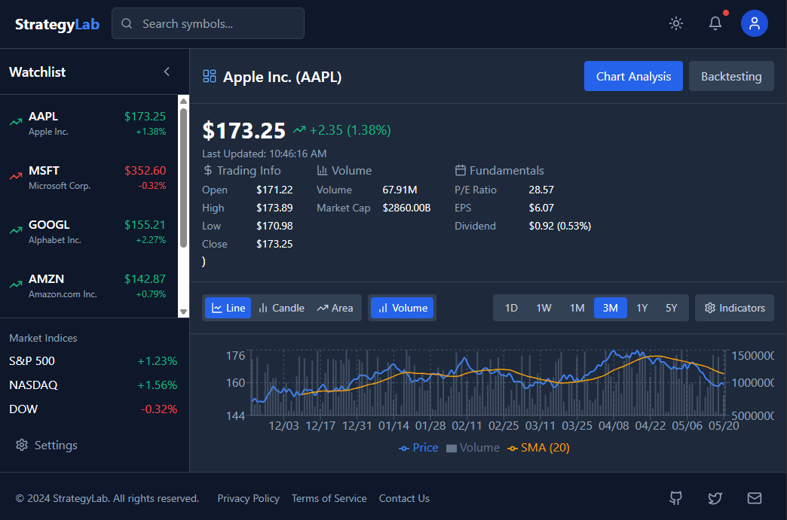

# Strategy Lab - analyse markets


### A configurable lab to implement custom technical indicators and strategies.

## Features

- Real-time stock price tracking with automatic updates
- Technical analysis with customizable indicators (SMA, EMA, RSI, MACD)
- Portfolio tracking with performance metrics
- Custom strategy builder and backtesting
- Alert system based on price thresholds and indicator signals

## Installation

1. Clone the repository
2. Create and activate a virtual environment (recommended)
3. Install dependencies:
```bash
pip install -r requirements.txt
```
4. Run the application:
```bash
python app.py
```

## Usage

1. Select stocks from the dropdown menu
2. Choose technical indicators to display
3. Add stocks to your portfolio with buy price and quantity
4. Set alert thresholds
5. View backtest results for the SMA crossover strategy

## Requirements

- Python 3.8+
- Dash
- Plotly
- Pandas
- yfinance
- TA-Lib

## License

MIT